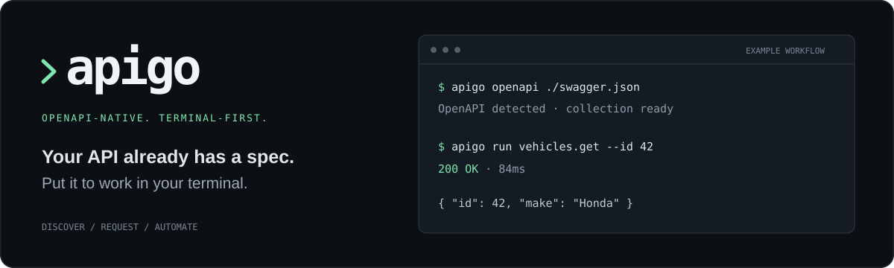

<div align="center">



**An OpenAPI-native API client for your terminal.**

Discover endpoints. Generate requests. Stay in your development workflow.

[](https://github.com/Mo7ammedd/apigo/actions/workflows/ci.yml)


[](LICENSE)
[](https://www.npmjs.com/package/@mo7ammedd/apigo)

[npm package](https://www.npmjs.com/package/@mo7ammedd/apigo) · [Quick start](#quick-start) · [OpenAPI](#openapi-and-swagger) · [Requests](#requests-and-overrides) · [Security](#security-model) · [Development](#development)

</div>

---

## Why apigo

Your backend already describes its routes, parameters, schemas, and authentication in OpenAPI. Rebuilding that information in a separate API client adds work and creates another collection to maintain.

**apigo turns that specification into commands.** Import Swagger from a running ASP.NET Core service, a Node.js backend, a Java application, or a Go API. Browse its operations, provide the values that matter, and send requests directly from your terminal or CI pipeline.

| Built for | What you get |
| --- | --- |
| Backend development | OpenAPI operations, typed parameters, schema examples, interactive required fields |
| Terminal workflows | Direct HTTP commands, saved overrides, collections, replayable history |
| Automation | JSON bodies on stdout, numeric status output, predictable exit codes |
| Changing APIs | Refresh without losing environments or saved requests; inspect potentially breaking changes |
| Local control | SQLite persistence, encrypted credentials, filtered output, no telemetry |

There is no web frontend or hosted account. Your API definitions and settings stay on your machine.

## Installation

Requires **Node.js 22 or newer**. Development and CI use the latest supported Node.js 22/24 releases.

The npm package is [@mo7ammedd/apigo](https://www.npmjs.com/package/@mo7ammedd/apigo), and it installs the `apigo` command. See the [changelog](CHANGELOG.md) for release notes.

With **npm 12 or newer**, allow SQLite's native installer explicitly:

```bash
npm install -g @mo7ammedd/apigo --allow-scripts=better-sqlite3
```

With npm 10 or 11:

```bash
npm install -g @mo7ammedd/apigo
```

Then run:

```bash
apigo --help
apigo --version
```

To run without a global install on npm 12+:

```bash
npx --allow-scripts=better-sqlite3 @mo7ammedd/apigo --help
```

Omit `--allow-scripts=better-sqlite3` on npm 10/11. Repository installs declare the required SQLite/esbuild script policy in `package.json`.

To install from this repository:

```bash
npm ci
npm run build
npm link
```

To install the distributable without a development checkout:

```bash
npm pack
npm install -g ./mo7ammedd-apigo-0.1.0.tgz --allow-scripts=better-sqlite3
```

Omit `--allow-scripts=better-sqlite3` on npm 10/11.

### SQLite installation errors

`SQLITE_UNAVAILABLE` means SQLite's native module is missing or incompatible with the active Node.js version. Version `0.1.0` can report this problem as `DATABASE_ERROR` with a misleading directory-permissions hint.

For a global install, rebuild the native module:

```bash
npm rebuild -g better-sqlite3 --allow-scripts=better-sqlite3
```

For a local project, add `"better-sqlite3": true` to the project's `allowScripts` object in `package.json`, then run `npm rebuild better-sqlite3`. npm 12 does not accept the `--allow-scripts` command-line flag for project-scoped installs or rebuilds.

The rebuild needs write access to npm's install directory; use the same administrator privileges as the original installation if required. Run `apigo` as your regular user.

## Quick start

After [installing apigo](#installation):

```bash
apigo openapi https://localhost:7043/swagger/v1/swagger.json

apigo run vehicles.list
```

Endpoint names come from your specification; `apigo api show` lists the exact commands.

```text
OpenAPI 3.0.1 detected
API: CarLink API (carlink-local)
Version: v1
7 endpoints · 5 schemas

Collections

  Vehicles
    GET     /api/vehicles                        vehicles.list
    POST    /api/vehicles                        vehicles.create
    GET     /api/vehicles/{id}                   vehicles.get
    PUT     /api/vehicles/{id}                   vehicles.update
    DELETE  /api/vehicles/{id}                   vehicles.delete
```

```bash
apigo run vehicles.get --id 42
apigo run vehicles.list --page 2 --limit 50
apigo run vehicles.create
```

On an interactive terminal, missing required parameters and body fields are prompted for. apigo previews an interactively built request before asking to send it. In CI or machine-output modes, missing input produces a concise error instead.

## OpenAPI and Swagger

Import JSON or YAML from a URL or local file:

```bash
apigo openapi https://api.example.com/openapi.json --name staging
apigo openapi ./swagger.json --name local
apigo openapi ./openapi.yaml

apigo api list
apigo api show
apigo api show --operation vehicles.get
apigo api use staging
apigo api remove local
```

OpenAPI **3.0**, **3.1**, and practical **Swagger 2.0** support includes:

- Tags, operation IDs, descriptions, deprecation, and operation-level servers.
- Path, query, header, and cookie parameters; defaults, types, enums, and constraints.
- JSON and URL-encoded bodies, content types, examples, and nested schemas.
- Response schemas/examples and Bearer, Basic, API key, OAuth2, and OpenID security metadata.
- Bundled JSON Pointer references, local external files, same-origin remote references, and recursive schemas.

Tags become collections. Operation IDs become readable names and remain available as aliases. For example, an unambiguous `getVehicles` becomes `vehicles.get`, with a `vehicles.list` alias for a collection GET. When a list route and an item route compete for the same name, apigo separates them into `vehicles.list` and `vehicles.get`. Inspect names before scripting against a new API.

The latest imported API becomes active. Select another per command with `--api <name>`.

### ASP.NET Core

Start your API and import the Swashbuckle or NSwag document:

```bash
dotnet run

apigo openapi https://localhost:7043/swagger/v1/swagger.json --name carlink-local
apigo api show
apigo run vehicles.list
```

apigo infers the origin from the Swagger URL when the document omits `servers`. Set `BASE_URL` when your deployment has a different host or mount path.

For development HTTPS, trust the certificate in Node's CA configuration, for example with `NODE_EXTRA_CA_CERTS`. To explicitly skip verification for a local request:

```bash
apigo openapi https://localhost:7043/swagger/v1/swagger.json --no-verify
apigo run vehicles.list --no-verify
```

The import flag does not disable TLS verification globally or for later requests.

### Schemas and request bodies

```bash
apigo schema list
apigo schema show Vehicle
apigo schema show CreateVehicleRequest --example --json > vehicle.json

# Edit the generated values before sending.
apigo run vehicles.create -b @vehicle.json

# Preview an operation's preferred example without sending it.
apigo run vehicles.create --example --dry-run
```

Examples take precedence over generated values. Request generation handles primitive types, enums, arrays, nested objects, `allOf`, a selected `oneOf`/`anyOf` variant, nullable properties, and references. Read-only fields are omitted from generated requests. Use `--required-only` with `schema show --example` for a minimal object.

Generated examples are starting points: arbitrary patterns and complex schema combinations can still require edits. Supplied parameters and modeled request bodies are validated before a request is sent.

## Requests and overrides

OpenAPI values remain editable:

```bash
apigo run vehicles.list --page 2 --limit 50 -H 'X-Debug: true'
apigo run vehicles.get -p id=42
apigo run vehicles.list -q tag=sedan -q tag=electric
apigo run vehicles.create -b '{"vin":"1HGCM82633A004352","make":"Honda","model":"Accord","year":2023}'
apigo run vehicles.create -b @vehicle.json --timeout 10000
cat vehicle.json | apigo run vehicles.create -b @-
```

Use `-p`, `-q`, or `-H` when an OpenAPI parameter name collides with a CLI flag, or appears in more than one location. Arrays also accept comma-separated values or JSON arrays. Object parameters accept JSON; common `form`, `deepObject`, delimited query, and simple/label/matrix path serialization are supported.

You can send requests before importing a specification:

```bash
apigo get https://api.example.com/health
apigo post https://api.example.com/users -b '{"name":"Ada"}'
apigo put https://api.example.com/users/42 -b @user.json
apigo patch https://api.example.com/users/42 -b '{"name":"Grace"}'
apigo delete https://api.example.com/users/42
```

| Option | Behavior |
| --- | --- |
| `-H, --header 'Name: value'` | Override a header; repeat for multiple headers |
| `-q, --query name=value` | Override/add a query parameter; repeat a name for multiple values |
| `-p, --param name=value` | Set an OpenAPI path parameter |
| `-b, --body [value]` | Inline body, `@file`, or `@-`; without a value, output only the response body |
| `--content-type <type>` | Select a supported request media type |
| `--base-url <url>` | Override the API server |
| `--timeout <ms>` | Whole-request timeout, including response download |
| `--no-verify` / `--verify` | Disable/enable certificate verification for this request |
| `--follow-redirects` | Follow up to five redirects |
| `--example` | Use a schema example or generated request body |
| `--dry-run` | Prepare and inspect a request without sending it |
| `--no-auth` | Explicitly send without configured credentials |
| `--no-history` | Skip history for this request |
| `--yes` | Confirm generated requests or collection writes |

## Environments

```bash
apigo env create local --set BASE_URL=https://localhost:7043
apigo env create production --set BASE_URL=https://api.example.com

apigo env set local TOKEN --from-env DEV_API_TOKEN
apigo env use local
apigo env show local
apigo run vehicles.list
apigo run vehicles.list --env production
```

`{{NAME}}` placeholders resolve from the selected environment, including nested values. `BASE_URL` overrides the specification's server unless `--base-url` is supplied. Missing variables and reference cycles produce errors.

```bash
apigo env set local CLIENT_NAME backend-tools
apigo run vehicles.list -H 'X-Client: {{CLIENT_NAME}}'

apigo env list
apigo env unset local CLIENT_NAME
apigo env delete production
```

All values, including `BASE_URL`, are masked by `env show` unless `--show-sensitive` is passed. Use `--from-env`, `--stdin`, or the hidden prompt for credentials. Plain command-line values can remain in your shell history.

Ambient shell variables do not silently override a selected environment. Import a value explicitly with `env set --from-env`, or use a live authentication reference as below.

## Authentication

Authentication is scoped to the active API and applied according to each operation's security requirements. Public operations receive no configured credentials.

```bash
# Hidden prompt; alternatively uses {{TOKEN}} when TOKEN exists in the active environment.
apigo auth set bearer

# Resolve a fresh token at request time without saving its value.
apigo auth set bearer --token-env DEV_API_TOKEN

apigo auth set basic --username-env API_USER --password-env API_PASSWORD
apigo auth set apikey --scheme ApiKey --token-env API_KEY
apigo auth set oauth2 --token-env ACCESS_TOKEN --scopes vehicles.read

apigo auth show
apigo auth clear
```

Use `--scheme <name>` for endpoints requiring multiple schemes together. Security requirement alternatives are also supported. HTTP headers supplied explicitly take precedence over configured authentication.

For direct HTTP commands, opt in to global authentication:

```bash
apigo auth set bearer --global --token-env DEV_API_TOKEN
apigo get https://api.example.com/me --auth
```

Direct API keys also accept `--name X-API-Key --in header` (or `query`/`cookie`). OAuth2 currently accepts an existing access token and scope metadata; browser authorization, token acquisition, and automatic refresh are deferred.

## Output and automation

The default view shows the method, URL, HTTP status, duration, size, and formatted body. Output modes contain no spinner, heading, or status decoration on stdout.

```bash
apigo run vehicles.list --json | jq '.[] | .vin'
apigo run vehicles.list --body
apigo run vehicles.list --raw
apigo run vehicles.list --headers
apigo run vehicles.list --headers --json
apigo run health.check --status
```

`--json` emits the **response body**, not a metadata envelope. Text responses become JSON strings. `--raw` preserves nonsecret text and its whitespace; sensitive content is still filtered. `--headers --json` emits a header object. `--body` without a value is a response-output selector; `-b @file` supplies a request body.

### CI/CD

```bash
export APIGO_HOME="$RUNNER_TEMP/apigo"

apigo openapi "$OPENAPI_URL" --name service --json > /dev/null
apigo auth set bearer --token-env API_TOKEN --non-interactive
apigo run vehicles.list --json --non-interactive > vehicles.json

STATUS=$(apigo run health.check --status)
if [ "$STATUS" = "200" ]; then
  echo "healthy"
fi
```

`API_TOKEN` is supplied by your CI secret store. For an API diff gate, compare an existing imported baseline with `apigo api diff --remote --check --json`.

| Exit code | Meaning |
| --- | --- |
| `0` | Successful command / HTTP status below 400 |
| `1` | HTTP 4xx/5xx, breaking diff with `--check`, or unexpected failure |
| `2` | Invalid input, missing data/authentication, specification or storage error |
| `3` | Network, redirect, or response-size failure |
| `4` | Request timeout |
| `130` | Cancellation |

Errors go to stderr. HTTP error responses remain available in the selected output mode.

## Saved requests and history

```bash
apigo run vehicles.list --page 2 --limit 50
apigo save vehicles-page-two
apigo run vehicles-page-two

# Save an operation and overrides without sending it.
apigo save first-page vehicles.list -q page=1 -q limit=10
apigo saved list
apigo saved show first-page
apigo saved remove first-page

apigo history
apigo history show 8f21ab
apigo history run 8f21ab --page 3
apigo history clear
```

Saved OpenAPI requests refer to the current operation, so refreshes preserve user overrides. Replays use current authentication and the selected environment. Credentials in literal headers are omitted; use environment placeholders for replayable sensitive input. Redacted body fields must be supplied again before sending.

History retains up to 1,000 entries by default, with request/response body snapshots capped at 64 KB. `--show-sensitive` never recovers credentials removed from history. Disable persistence for an individual request with `--no-history`, or set `historyLimit` to `0`.

## Collections

```bash
apigo collection list
apigo collection show vehicles
apigo collection run health --json

apigo collection run vehicles -p id=42 --example --dry-run --no-auth
apigo collection run vehicles -p id=42 --example --yes
```

All requests are prepared and validated before the first is sent. Collections execute sequentially. Any collection containing writes requires confirmation, or explicit `--yes` in CI. Execution stops at the first HTTP/network failure unless `--continue-on-error` is supplied.

Collection `--json` output is an array of operation results containing status, duration, and body. It uses a different shape from a single request's body-only JSON output. Only tables and JSON are supported for collection results.

## Refresh and API diff

```bash
apigo api refresh carlink-local
apigo api diff carlink-local
apigo api diff carlink-local --remote
apigo api diff carlink-local --remote --check --json
```

```text
OpenAPI changed

ADDED
+ GET /api/recommendations

REMOVED
- DELETE /api/vehicles/{id}  [potentially breaking]

CHANGED
~ GET /api/vehicles
  + sort query parameter
~ Vehicle
  + year
  - legacyId  [potentially breaking]
```

Refresh updates API definitions and derived collections in SQLite while preserving environments, credentials, and saved overrides. A failed import leaves the existing definition intact.

`api diff` shows the last nonempty refresh diff. Before any refresh, it compares with the source. `--remote` always compares the stored API against its current source without updating local data. Breaking-change labels are conservative signals for review, not a full compatibility proof.

## Postman import and export

```bash
apigo import postman ./collection.json --name legacy
apigo export postman ./collection.export.json
```

Postman v2.0/v2.1 folders, methods, headers, URL/path/query variables, raw and URL-encoded bodies, and common authentication settings are converted into operations. Variables and extracted credentials go into a dedicated encrypted `<api>-postman` environment. Re-imports preserve existing environment values.

Exports use credential placeholders. Existing files require `--force` before replacement. Postman scripts/tests are never executed; dynamic Postman variables, multipart bodies, and advanced auth flows are outside this MVP. OpenAPI remains the primary workflow.

## Configuration

```bash
apigo config list
apigo config get timeout
apigo config set timeout 10000
apigo config set historyLimit 500
apigo config reset
```

| Key | Default |
| --- | --- |
| `timeout` | `30000` milliseconds |
| `verify` | `true` |
| `followRedirects` | `false` |
| `maxResponseBytes` | `10485760` (10 MB) |
| `historyLimit` | `1000` |
| `activeApi` | Selected by import or `api use` |
| `activeEnvironment` | Selected by `env create` / `env use` |

Storage uses a dedicated OS-appropriate directory:

| Platform | Default directory |
| --- | --- |
| Linux | `$XDG_CONFIG_HOME/apigo` or `~/.config/apigo` |
| macOS | `~/Library/Application Support/apigo` |
| Windows | `%LOCALAPPDATA%\apigo` |

Override it with `APIGO_HOME` or `--config-dir`. Configuration reset restores settings; it does not remove imported APIs, environments, or history.

## Security model

- Environment values, credentials, API definitions, saved requests, and history payloads are encrypted with **AES-256-GCM**. SQLite migrations and foreign keys maintain local state.
- A random encryption key is stored separately in `secret.key`. POSIX storage directories require mode `700`; the database and key require `600`. Windows access follows the user's directory ACLs.
- `APIGO_SECRET_KEY` can supply a stable base64-encoded 32-byte key instead. Back up the database **and** its matching key; losing the key makes encrypted records unreadable.
- Encryption reduces plaintext exposure in database files and backups. An attacker with access to your user account and key can decrypt the data. This is not an OS keychain or hardware-backed vault.
- Authorization, API keys, passwords, cookies, and recognized sensitive values are masked in normal output, verbose diagnostics, and history. Explicit `--show-sensitive` affects display only.
- Redaction recognizes sensitive field names, OpenAPI API-key names, and values used by credentials/environments. For unstructured confidential payloads, use `--no-history` and handle output appropriately.
- TLS verification is enabled by default. Redirects are opt-in; cross-origin redirects discard custom headers and credentials. HTTPS downgrades and cross-origin body forwarding are rejected.
- Remote references cannot read local files. References normally stay on the source origin or inside the local specification directory. `--allow-external` explicitly relaxes those boundaries without forwarding authorization across origins.
- There is no telemetry, cloud synchronization, script execution, or automatic reading of arbitrary shell variables from imported specifications.

## Debugging

```bash
apigo run vehicles.list --verbose
apigo run vehicles.list --debug
```

Verbose request details and measured timings go to stderr. DNS, TCP, and TLS appear when observed; `HEADERS` is elapsed time to response headers, and includes connection/setup time. Download and total times are measured separately. These are client measurements, not invented server-side timings.

Use `--debug` for sanitized stack traces. Credentials remain filtered unless explicitly requested for request/response display.

## Development

```bash
npm ci
npm run dev -- --help
npm run typecheck
npm run lint
npm test
npm run build
npm run test:package
```

The package smoke test packs the distributable, checks missing/incompatible native-module diagnostics, rebuilds SQLite for project/global installs, and verifies the installed executable, SQLite-backed import/run workflow, `npx` resolution, and `npm link`. The installation checks use the local tarball.

```text
src/
  cli/           Command parsing, prompts, and thin command handlers
  core/          API selection, operation naming, request preparation, execution
  openapi/       Loading, reference resolution, parsing, generation, validation, diff
  http/          Fetch transport, redirect policy, timeouts, measured timing
  auth/          Credential profiles and OpenAPI security requirements
  environments/  Encrypted environment management and interpolation
  collections/   Group lookup, preflight, sequential execution
  history/       Redaction, retention, saved requests, replay
  postman/       Secondary import/export support
  storage/       SQLite migrations and authenticated encryption
  config/        Validated settings and platform paths
  output/        Human and machine rendering
```

Domain services are independent of Commander and terminal rendering. Tests include realistic ASP.NET Core Swagger fixtures, OpenAPI 3.1 YAML, Swagger 2.0, references, live HTTP/HTTPS servers, persistence, security filtering, and CLI processes. TLS tests generate disposable certificates with OpenSSL and are skipped when OpenSSL is unavailable.

See [CONTRIBUTING.md](CONTRIBUTING.md) for development conventions and [CHANGELOG.md](CHANGELOG.md) for release notes.

### MVP boundaries

The core CLI and OpenAPI workflow are implemented first. TUI browsing, multipart/file uploads, binary downloads, cookie jars, WebSockets, OAuth2 grant/refresh flows, and JSON Schema dynamic/anchor reference support are deferred. TRACE is discoverable but cannot be sent through Fetch. External examples are not downloaded automatically.

## Publishing to npm

Publishing requires npm access to `@mo7ammedd/apigo`. Sign in as `mo7ammedd` or an authorized collaborator, and use a new version for each release.

```bash
npm whoami
npm run check
npm run test:package
npm pack --dry-run

npm publish --access public
```

`prepack` builds `dist/index.js`, preserves `#!/usr/bin/env node`, and marks the entry executable. The manifest exposes `"bin": { "apigo": "./dist/index.js" }`; no global runtime dependency beyond Node.js is required. SQLite downloads prebuilt binaries for supported Node/platform combinations; a source-build fallback requires a C++ toolchain. The MVP uses the 12.x SQLite driver line for compatibility with npm versions shipped with Node.js 22.

## License

[MIT](LICENSE) © 2026 apigo contributors.
